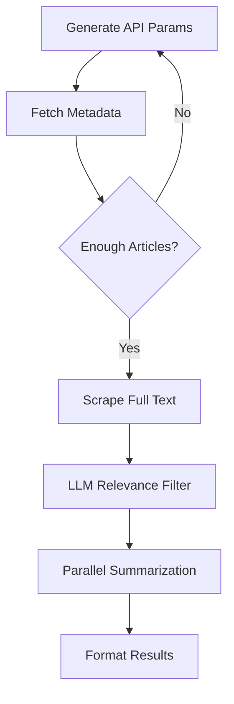

🔗 **Notebook Link:** [NewsAgent](https://www.kaggle.com/code/suvroo/newsagent)  


## Tech Stack  
- **Core Framework**: LangGraph (Stateful Workflow Orchestration)  
- **LLM Provider**: Groq (Llama-3.3-70B)  
- **News APIs**: NewsAPI, Google News, BBC News  
- **Web Scraping**: BeautifulSoup + Custom Extraction Pipeline  
- **Analysis Tools**: PyDantic (Data Modeling), Regex (Pattern Matching)  


## Key Features  
1. **Adaptive News Discovery**  
   - Auto-generates optimal NewsAPI parameters (date ranges, sources, keywords)  
   - Fallback searches with expanded parameters when initial results are sparse  

2. **Intelligent Filtering**  
   ```python  
   def select_top_urls(state):  
       """LLM-powered relevance ranking of 100+ articles"""  
       # Uses query context to filter non-relevant content  
       return top_3_articles  
   ```

3. **Parallel Processing**  
   - Concurrent summarization of 5+ articles using async/await  
   - Maintains source attribution and publication dates  

4. **Enterprise-Grade Output**  
   ```markdown  
   ## Foxconn EV Market Expansion [^1]  
   * Investing $1.3B in auto-tech acquisitions  
   * Targeting 40% global EV production share  
   [^1]: Financial Post | 2024-12-13  
   ```

---

## Workflow Architecture  



